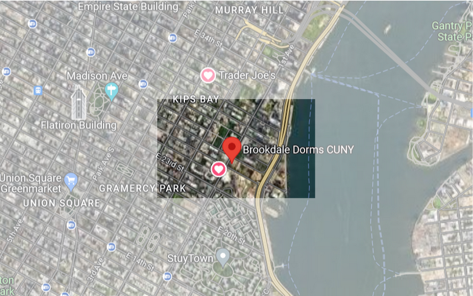
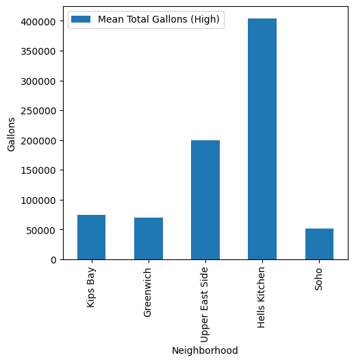
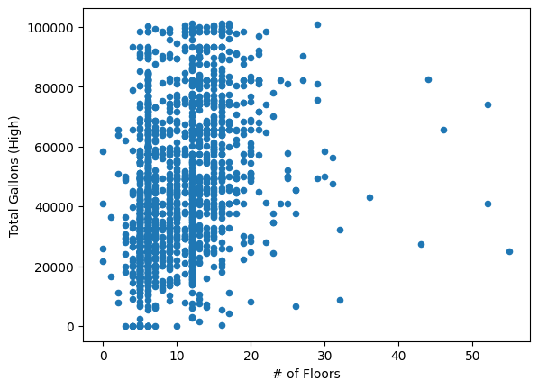
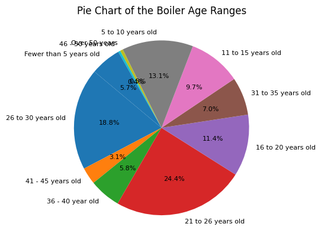

# Kips Bay

## Highlighted map of HC6

## Basic demographics and statistics (HC2)
Kips Bay is represented by zip codes 10010 and 10016, and is familiar to some due to the presence of Brookdale dorms. In zip code 10010, covering 0.37 sq miles, the population is 33,193, resulting in a high density of 90,054 people per square mile. The demographic makeup is diverse, with a median age of 36 and a predominantly white population (62%), followed by Asian (15%), Hispanic (10%), Black (9%), and mixed/other (4%). Education levels are notably high, with 78% having a Bachelor’s Degree or higher, contributing to a median household income of $131,635. In zip code 10016, covering 0.55 sq miles, the population is 56,758, with a density of 103,341 people per square mile. The demographic characteristics are similar to 10010, with a slightly younger median age of 33 and a median household income of $136,431. Both areas have a significant proportion of educated residents, smaller household sizes, and high housing values, suggesting a population of couples without children.
## HC3 Summary
When researching the NYC Clean Heat Program we learned about how the program was initiated to help NYC buildings become more green and energy efficient. We learned how harmful fuel 4 and fuel 6 can be to the environment and how the program has measures to limit the use of these fuels. We also learned about the DEP Boiler Registration which forces any new boiler system registered with NYC DEP to be put into a triennial cycle of registration. Lastly, we learned about the Greener Greater Buildings plan which is a set of energy laws and initiatives aimed at improving the energy efficiency of NYC buildings. 
## HC4 Summary
We learned about how NYC's reliance on aging power plants and the use of natural gas contribute to high emissions and air pollutants. Buildings, especially in Manhattan, are identified as the largest source of GHG emissions, with a notable concentration in properties built in the 1950s. Legislation such as Local Law 97 aims to reduce emissions from large buildings, which are responsible for a substantial portion of carbon dioxide output. The text also highlights the energy inefficiency of appliances in Manhattan's densely populated buildings and the strain they place on electricity consumption. Despite these challenges, NYC is implementing measures to reduce emissions, such as the 2026 law banning fossil fuels in most new buildings.
## HC7 and HC8 Summary
In HC7/HC8, I learned some things. First, I learned that out of all our neighborhoods in Manhattan, we found out that Hells Kitchen has the highest Mean Total Gallons. Here is the graph:

I also learned that there is no correlation between the number of floors and the total amount of gallons in each building. Here is the graph:

Finally, I learned about the ages of boilers in each building. Most boilers are between 10 to 30 years old. Here is the graph:

In conclusion, we learned a lot about our neighborhood's buildings and a lot about cleaning and visualizing data to convey certain trends or statistics that are important.
## Map of HC9
Here is my map from HC9:
<dl>
<iframe src="boilerMap.html" width="600" height="400" frameborder="0" frameborder="0" marginwidth="0" marginheight="0" allowfullscreen></iframe>
</dl>

